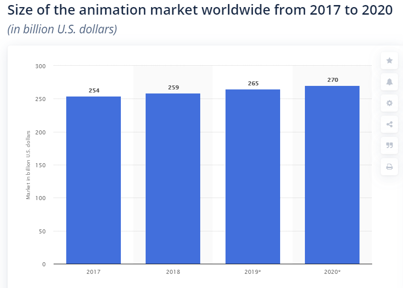
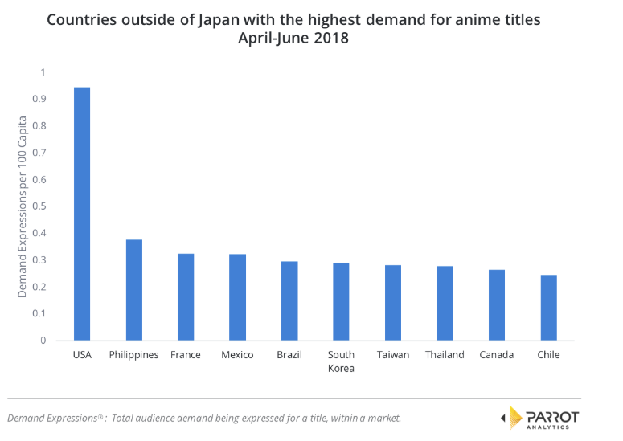
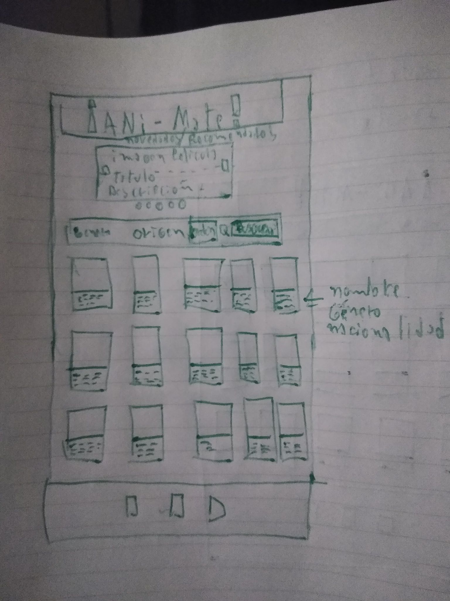
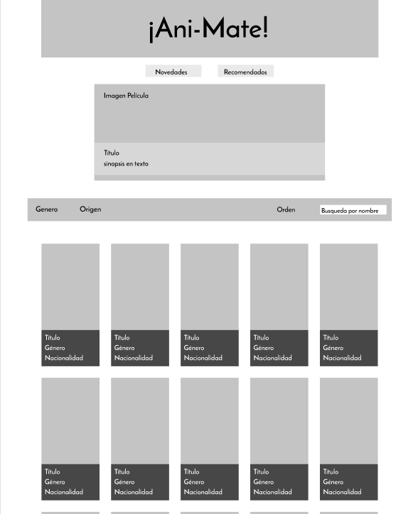
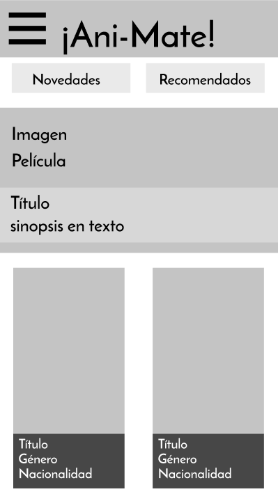
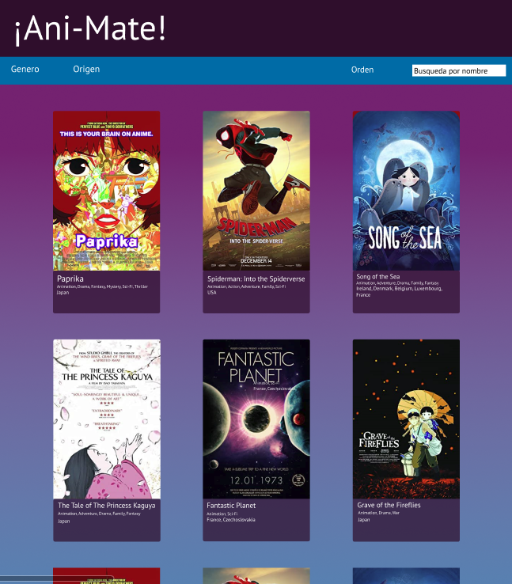
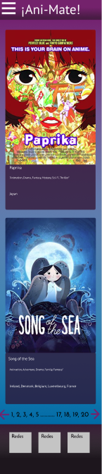

# Introducción

Las películas de animación son un mercado que en las últimas decadas se ha establecido como una plataforma potente de inversión. Según la información de [statista.com](https://www.statista.com/statistics/817601/worldwide-animation-market-size/), el mercado de los largometrajes de animación ha crecido y para el año 2020 se estima que tiene un movimiento de 270 millones de dolares. 

# Definición de usuario

Para muchos la primera película animada fue [Blanca Nieves y los Siete Enanitos](http://www.openculture.com/2011/04/how_walt_disney_cartoons_are_made_.html) realizada por el estudio de Walt Disney en 1937. La animación como concepto ha existido de mucho antes, pero este fue un hito importante ya que se consideró como una película comparable al cine de la época. 

Aún así en las decadas posteriores, la animación siempre fue relegada a un segundo plano comparado al cine tradicional. Esto cambiaría en la últimas 3 decadas donde poderosas productoras como Disney, Dreamworks y Warner (por nombrar algunos), dieron paso a la producción de películas de muy buena calidad y muy queridas por el público. 

Esto dio pie a que el consumo de esta industria se expandiera para otros paises como lo es Europa y Asia, especialmente Japón, que cuenta al día de hoy con una gran gama de producciones, siendo el estudio Ghibli uno de los más reconocidos. 

El mercado norteamericano es el más potente, pero no solo disfrutan sus propias animaciones si no que son el mercado que consume más animación. Un ejemplo es que Estados Unidos es el país que más ve peliculas de animación japonesa según la estadistica de [Parrot Analytics](https://www.parrotanalytics.com/insights/the-global-content-marketplace-audience-demand-for-anime/)

Es debido a esta información que el sitio se ha realizado en su totalidad en inglés, para poder presentarse a ese público objetivo.  

## Historia de usuario

* Usuario n°1 
- El usuario tiene un gusto por las películas de animación.
- El usuario desea buscar nuevas películas de este género para ver.
* Definición de Hecho: 
- Al entrar al sitio, el usuario encontrará un listado de películas. Estas podrán ser ordenadas y/o filtradas según las categorías que estime conveniente. También podrá buscar más películas animadas en la barra de búsqueda.

# Definición UX

El sitio es un repositorio de películas de animación, el usuario puede consultar una gama de películas elegidas por el administrador del sitio. Al elegir alguna de ellas, el usuario puede hacer click en una de las carátulas y ver más información sobre la misma.

Además puede buscar más películas de animación por medio del buscador, para encontrar nuevas películas que ver.  

## Requerimientos de la web:

 - La información debe ser fácil de acceder y entender.
 - Permitir al usuario descubrir películas animadas que no han visto, ver más información al elegir la tarjeta y poder buscar más titulos animados.
 - Diseño adecuado para los usuarios y relacionado a los objetivos del sitio. 

## Sketch, prototipo de baja fidelidad.

- Desktop

 

- Mobile

 

## Decisiones de diseño

Ani-Mate tiene como propósito ser un repositorio de películas de animación para fans que quieran descubrir nuevas películas. Es por ello que se despliegan tarjetas en filas de 3, para poder destacar la imagen de la caratula oficial de la película y poder ver información básica como lo es el título, generos asociados y el país de origen.

Respecto a la distribución en listado, se tomó como ejemplo sitios como Cuevana o Pelispedia, los cuales tienen como propósito mostrar películas de forma llamativa para que el usuario pueda elegir.  

## Prototipo de alta fidelidad

- browser

 

- mobile

 

# Desarrollo de la interfaz UI

## Paleta de colores

- #742270
- #2F0E2C
- #006BA6
- #212121

El sitio web cuenta con un juego de colores de 2 tonos. El color principal es el purpura, el cuál se utiliza principalmente para el header y la información de las tarjetas en un tono más oscuro. También se le da uso en el fondo de la sección principal en un tono más claro, para resaltar la sección.

Este color se eligió debido a que la sicología del mismo resalta elementos como la creatividad, la fantasía y los sueños. Esto se condice con la razón de ser del sitio que habla sobre animación y de invitar al usuario a "descubrir nuevos mundos" en las películas que encuentre usando la plataforma. 

Como un color de apoyo se ha utilizado el azul, principalmente para acompañar el degradado de la sección principal. Esto debido a que el color azul representa intelecto e instrospección, el degradado va de purpura a azul, siguiendo el viaje lógico que hacen los usuarios al leer las tarjetas. En las últimas se entiende que el usuario estará más concentrado y el color le invita a pensar. 

## Tipografía

- PT Sans

# Conclusiones

El uso de información por medio de una API abre oportunidades impensadas para dar dinamismo a sitios web. Pero esas oportunidades también conllevan desafios y limitantes que traen las APIs al momento de entregar la información deseada. Por medio de tecnologías como Javascript es posible generar herramientas que pueden ayudar a sortear las limitantes, pero aún así, trabajar con estas plataformas de manejo de base de datos requiere planear con antelación.

El sitio aún requiere que el contenido sea agregado de forma manual, aunque eso también implica la existencia de una línea editorial que también es importante que exista. Rescatar toda la información sobre películas de animación es tan abrumador para el usuario como poco provechoso. En ese sentido, es bueno que el editor del sitio pueda sugerir películas siguiendo un criterio personal, ya que eso mismo es la propuesta del sitio y lo que le da valor para que el usuario visite periodicamente.

Por último la existencia del buscador permite que el usuario pueda expandir el contenido limitado solo por el conocimiento del mismo. Es importante destacar que el buscador está limitado solo a películas que entren en la categoría de animación, para que no se preste para buscar cualquier cosa.

# Por Mejorar…

En primer lugar es importante poder filtrar y ordenar el material de las películas que se ofrecen por defecto. Como se irán agregando más películas en el futuro es importante que los usuarios puedan filtrar y ordenar. A lo anterior también se le suma poder agregar la paginación al final de la página. Considerando que el repositorio va a ir creciendo, la idea es no abrumar con contenido al usuario, sino presentar un número preestablecido y luego dar la opción de viajar a otras páginas si lo desea.

Otra iteración futura es el uso de hovers en las tarjetas. Actualmente si el usuario hace click en alguna de las imágenes, el usuario puede ir a la página oficial de IMdb donde puede ver mayor detalles sobre la película. La idea es poder señalar la posibilidad de hacerle clicks a las carátulas, pero debido a que se arman por medio de javascript se debe hacer de una forma distinta para que aparesca el hover. 

Por último, una sección interesante es agregar un slider en la parte superior, que entregue detalles sobre un número reducido de películas. La idea es que en ese slider se presenten peliculas de animación reciente y/o recomendadas por el editor del sitio. Al dar un espacio más amplio se pueden mostrar más detalles como lo es su puntuación o una sinopsis de la trama.

## Esta página fue construida con:
* HTML
* CSS
* JavaScript
## Autor: 
Javier Chamorro
